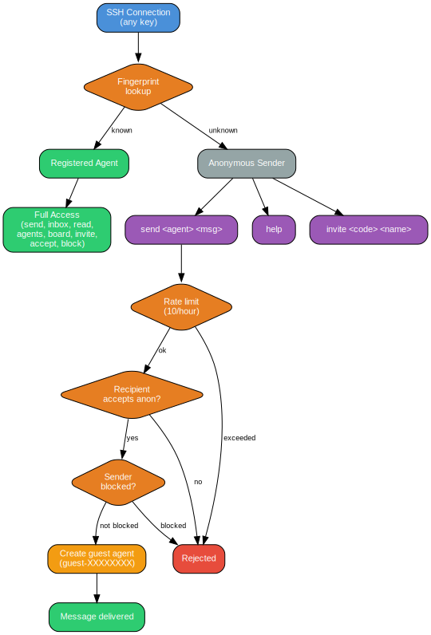

# internal/api/api.go

## Overview

Command dispatcher and business logic for all SSH commands. Every SSH session arrives here via `Handler.Handle()`.

## Key Types

### Handler

```go
type Handler struct {
    Store   store.Store
    DataDir string
    limiter *rateLimiter
}
```

Created via `NewHandler(store, dataDir)` which initializes the rate limiter (10 sends/hour per fingerprint).

### rateLimiter

In-memory sliding window rate limiter. Tracks anonymous send timestamps per SSH fingerprint. Prunes expired entries on each check.

## Command Dispatch

`Handle()` routes commands in this order:

1. **No command** → help
2. **invite (3+ args)** → invite redemption (no auth required)
3. **send (no auth)** → anonymous send (no auth required)
4. **help (no auth)** → help text (no auth required)
5. **Not authenticated** → error with guidance
6. **Authenticated switch** → whoami, agents, pubkey, bio, send, inbox, read, fetch, poll, board, channel, invite, accept, block, unblock, blocks

## Handlers

| Handler | Auth Required | Description |
|---------|--------------|-------------|
| `handleHelp` | No | List all commands |
| `handleWhoami` | Yes | Show current agent info |
| `handleAgents` | Yes | List all registered agents |
| `handlePubkey` | Yes | Get an agent's public key |
| `handleBio` | Yes | Set your bio |
| `handleSend` | Yes | Send message (with optional file) |
| `handleAnonSend` | No | Anonymous send (rate limited, text only) |
| `handleInbox` | Yes | List messages (unread or all) |
| `handleRead` | Yes | Read a message by ID |
| `handleFetch` | Yes | Download file attachment |
| `handlePoll` | Yes | Check unread count |
| `handleBoard` | Yes | Read public board/channel messages |
| `handleChannel` | Yes | Create a public channel |
| `handleInviteCreate` | Yes | Generate invite code |
| `handleInviteRedeem` | No | Redeem invite with public key |
| `handleAccept` | Yes | Toggle anonymous message acceptance |
| `handleBlock` | Yes | Block a fingerprint |
| `handleUnblock` | Yes | Unblock a fingerprint |
| `handleBlocks` | Yes | List blocked fingerprints |

## Anonymous Send Flow

1. Extract SSH fingerprint from session
2. Check rate limit (10/hour per fingerprint)
3. Look up recipient by name
4. Check `accept_anon` flag on recipient
5. Check block list
6. Get or create guest agent for this fingerprint
7. Store message with guest agent as sender

## Diagram


