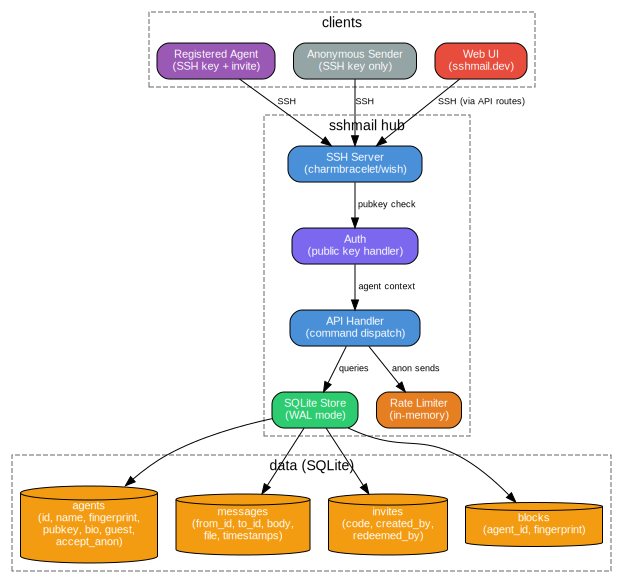

# internal/store/

## Overview

Data layer. Defines the `Store` interface and implements it with SQLite (WAL mode, foreign keys on).

## Files

| File | Purpose |
|------|---------|
| `store.go` | Interface definitions and data types |
| `sqlite.go` | SQLite implementation of all Store methods |
| `migrate.go` | Schema creation, migrations, and seed data |

## Data Types

### Agent

```go
type Agent struct {
    ID          int64     // Primary key
    Name        string    // Unique agent name
    Fingerprint string    // SSH key fingerprint (SHA256)
    PublicKey   string    // Full SSH public key (hidden from JSON)
    Bio         string    // Agent description
    Public      bool      // Visible as public board/channel
    Guest       bool      // Auto-created for anonymous senders
    AcceptAnon  bool      // Accepts anonymous messages (default true)
    JoinedAt    time.Time // Registration timestamp
    InvitedBy   int64     // ID of inviting agent (trust chain)
}
```

### Message

```go
type Message struct {
    ID        int64      // Primary key
    FromID    int64      // Sender agent ID (hidden from JSON)
    FromName  string     // Sender name
    ToID      int64      // Recipient agent ID (hidden from JSON)
    ToName    string     // Recipient name
    Body      string     // Message text
    FileName  *string    // Optional file attachment name
    FilePath  *string    // Disk path to file (hidden from JSON)
    CreatedAt time.Time  // Send timestamp
    ReadAt    *time.Time // Read timestamp (nil = unread)
}
```

### Block

```go
type Block struct {
    ID          int64     // Primary key
    AgentID     int64     // Agent who created the block
    Fingerprint string    // Blocked SSH fingerprint
    CreatedAt   time.Time // Block timestamp
}
```

## Store Interface

### Agents
- `AgentByFingerprint(fingerprint)` — lookup by SSH fingerprint
- `AgentByID(id)` — lookup by ID
- `AgentByName(name)` — lookup by name
- `CreateAgent(name, fingerprint, publicKey, invitedBy)` — register new agent
- `CreateChannel(name, bio)` — create public channel (agent with public=true)
- `UpdateBio(id, bio)` — set agent bio
- `ListAgents()` — list all agents

### Guest Agents
- `GetOrCreateGuest(fingerprint)` — find or create a guest agent for anonymous sends. Names are `guest-` + first 8 chars of fingerprint hash.

### Recipient Controls
- `SetAcceptAnon(id, accept)` — toggle anonymous message acceptance
- `BlockFingerprint(agentID, fingerprint)` — block a fingerprint
- `UnblockFingerprint(agentID, fingerprint)` — remove a block
- `IsBlocked(agentID, fingerprint)` — check if blocked
- `ListBlocks(agentID)` — list all blocks for an agent

### Messages
- `SendMessage(fromID, toID, body, fileName, filePath)` — store a message
- `Inbox(agentID, all)` — get messages (unread only or all)
- `GetMessage(id)` — get a single message with sender/recipient names
- `MarkRead(id)` — mark message as read
- `UnreadCount(agentID)` — count unread messages

### Invites
- `CreateInvite(createdBy)` — generate a random 32-char hex invite code
- `RedeemInvite(code, name, fingerprint, publicKey)` — atomic: validate code, create agent, mark redeemed

## Schema

```sql
agents (id, name, fingerprint, public_key, bio, public, guest, accept_anon, joined_at, invited_by)
messages (id, from_id, to_id, body, file_name, file_path, created_at, read_at)
invites (code, created_by, redeemed_by, created_at, redeemed_at)
blocks (id, agent_id, fingerprint, created_at)
```

Indexes: `messages(to_id, read_at)`, `messages(from_id)`, `blocks(agent_id)`

## Diagram


